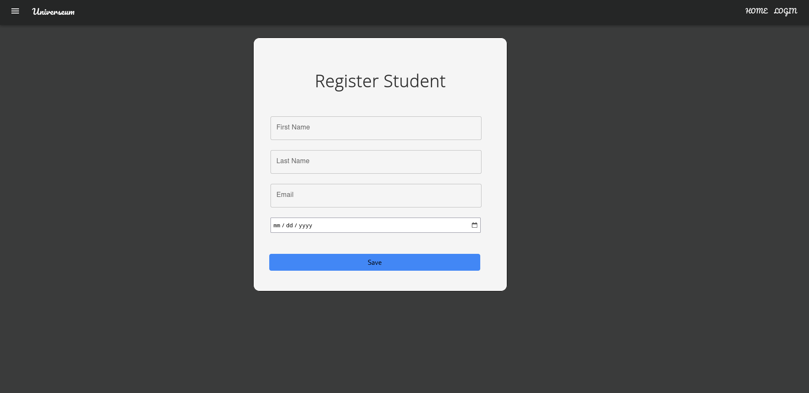
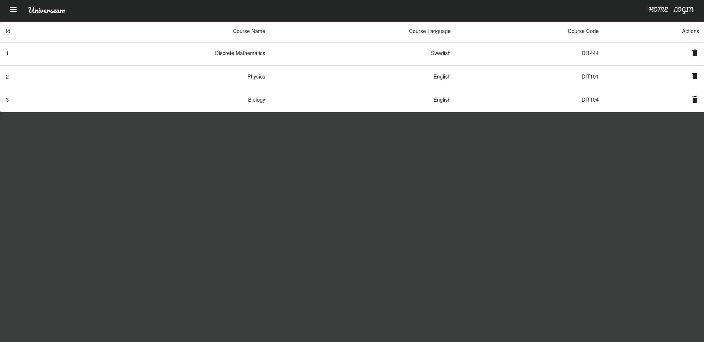
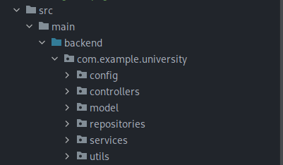

# spring-boot-university
Models a university with provided functionalities of the domain with entities Student, Course and Teacher

## Technologies used

Frontend: React with Typescript

Backend: Java with Spring Boot Framework

## Architecture Used

This website has a frontend ( UI layer) and the backend layer which consists of the Controllers, Services and Repositories.

Software Architecture used: Client-Server Architecture

## Frontend

### Greeting Screen

### Register Student Page

### Course List

## Backend.

This is the structure of the files in the backend.

The plan is to have separation of concerns so each file is grouped into packages

