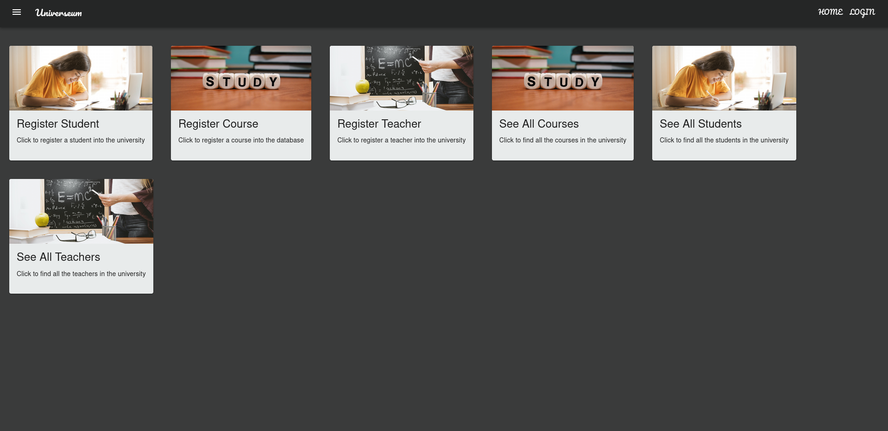

# Universeum - Student/Course Management Application
A simple Full-stack Spring-Boot-powered application that models a university with provided functionalities of the domain with entities Student, Course and Teacher.

## Technologies Used

**Frontend**: &nbsp;&nbsp;&nbsp;&nbsp;&nbsp;&nbsp;&nbsp;&nbsp;  **Backend**: 
 
 
  
&nbsp; &nbsp;&nbsp;&nbsp;&nbsp;

## Architecture Used

This website has a **frontend** (UI layer) and the backend layer which consists of the Controllers, Services and Repositories. This is an application built following a **Client-Server** styled Architecture.

## Frontend

### Greeting Screen

### Register Student Page

### Course List

## Backend.

This is the structure of the files in the backend.

The plan is to have separation of concerns so each file is grouped into packages.

